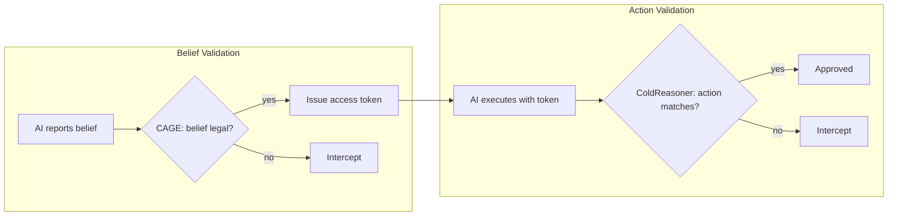

<div align="center">

[English](README.md) | [中文](README.zh.md)

# ColdContract

### L2 · Contract — the Verifiable-Contract Layer of the Cold Trust Protocol Stack

[](https://github.com/cold-os/ColdContract)
[](https://opensource.org/licenses/Apache-2.0)
[](https://github.com/cold-os)
[](https://www.python.org/)
[](https://github.com/Z3Prover/z3)

</div>

> **Layer:** L2 · Contract — Cold Trust Protocol Stack  
> **Research Question:** How can the terms of human–AI interaction be made formally checkable?  
> **Method:** Minimal Z3 encoding of the belief–token–action loop (decidable constraints).  
> **Status:** Pre-alpha prototype · not for production use.  
> **Related:** [ColdReasoner](https://github.com/cold-os/ColdReasoner) (L3) · [Cold Trust Protocol Stack](https://github.com/cold-os) · arXiv:2512.08740 · figshare:31696846

---

## 🧊 What It Is

ColdContract is the minimal, refined encoding of the trust protocol's *terms*: it turns "what an agent may claim, and what it may do" into **decidable logical constraints** on top of the Z3 constraint solver. It strips away philosophical framing and returns to engineering fundamentals — a runnable, verifiable interaction-contract engine.

The core mechanism is the **belief–token–action** closed loop: the AI reports its intent (belief) to the CAGE gateway; upon validation, CAGE issues an access token; the AI may only execute with a matching token. Any deviation — illegal belief, token abuse, unauthorized action — is captured and rejected by mathematical constraints.

> **⚠️ Design positioning**
> This is a minimal conceptual prototype. Its purpose is to encode the "belief–action consistency" verification paradigm as decidable logical constraints via Z3. It is not a full runtime system — it contains no network modules or real privilege management — and is constructed solely to validate the engineering feasibility of the contract kernel.

## 🔍 Why It Matters

- **Computational social science:** contracts are *formalized interaction norms* — machine-checkable terms make human–AI interaction auditable governance, and every verification decision is a data point for studying how interaction rules shape behavior.
- **HCI:** legible, checkable interaction terms are a precondition of *informed* trust — the human can verify the rules the agent is bound by.
- **AI governance:** authorization-by-contract — enforcement is encoded in advance, not improvised after the fact.

## 🎯 Core Design



**Scenario** — a file-system model with a closed set of formally defined actions and belief predicates:

| Type | Belief / Action | Status |
|------|-----------------|--------|
| Legal beliefs | READ, WRITE | ✅ Allowed to report |
| Illegal beliefs | DELETE, MODIFY | ❌ Forbidden to report |
| Legal actions | READ, WRITE | ✅ Allowed (with temporal constraints) |
| Conditional action | DELETE | ⚠️ Only if a READ occurred before |
| Illegal action | MODIFY | ❌ Permanently forbidden |

**Validation rules:**
1. **Belief legality** — only READ/WRITE are legal to report; DELETE/MODIFY are permanently forbidden as beliefs.
2. **Belief–action mapping** (forward implication) — reporting READ permits READ or DELETE; reporting WRITE permits only WRITE.
3. **Temporal constraints** — DELETE requires a prior READ in history; consecutive WRITEs are prohibited.
4. **Token issuance** — a concrete token with permission scope is issued upon passing; tokens can be revoked.

## 🚀 Quick Start

```bash
pip install z3-solver
python cold_reasoner_f.py
```

`sat` = a valid belief–action combination satisfying all constraints exists; `unsat` = the trace violates a rule and is rejected by the contract.

## 🔬 LLM Integration Test

`llm_integration_demo.py` drives the core engine with **qwen-plus** (Alibaba Cloud Bailian), simulating an agent under formal constraints. Four scenarios, all currently passing:

1. Belief–action mapping violation (READ → MODIFY) — intercepted ✅
2. Temporal violation (DELETE without prior READ) — intercepted ✅
3. Temporal violation (consecutive WRITE) — intercepted ✅
4. Unstructured natural-language input — safely rejected ✅

## 📜 AI Utilization Statement

Source code implementation for this project was completed through collaborative work between human authors and AI auxiliary tools.

**Human Author Contributions:**
- Core architectural design: closed-loop Belief-Token-Action pipeline
- Formal logical definition of validation rules (two-layer verification, exact matching replacing approximate semantics)
- Scenario abstraction and comprehensive test suite design

**AI Auxiliary Contributions:**
- Source code implementation and debugging
- Syntax standardization and formatting optimization
- Automated test case generation

Human authors bear full engineering responsibility for the correctness of the final source code artifact.

## 🧪 Limitations & Roadmap

- **Expressive power:** currently only simple temporal constraints (no LTL/CTL, no modal logic).
- **Scope:** file-system scenario only; other domains require redefining belief/action spaces and mappings.
- **Deployment:** no OS-level privilege enforcement — conceptual verification prototype only.

**Roadmap:** extend the rule set with temporal and dependency invariants; replace batch Z3 solving with an incremental runtime-monitoring engine; log decision traces to feed computational analysis of trust dynamics (CSS).

## 📄 License

Apache 2.0

---

*Part of the [Cold Trust Protocol Stack](https://github.com/cold-os) — trust protocols for human–AI interaction, anchored in computational social science.*
