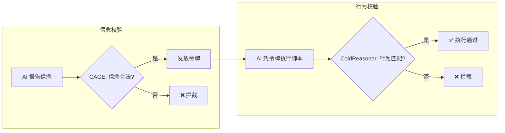

<div align="center">

[English](README.md) | [中文](README.zh.md)

# ColdContract

### L2 · 契约层 —— Cold Trust Protocol Stack 的可验证契约层

[](https://github.com/cold-os/ColdContract)
[](https://opensource.org/licenses/Apache-2.0)
[](https://github.com/cold-os)
[](https://www.python.org/)
[](https://github.com/Z3Prover/z3)

</div>

> **层次：** L2 · 契约层 —— Cold Trust Protocol Stack
> **研究问题：** 人机交互的条款，如何成为可被形式化检查的？
> **方法：** 基于 Z3 约束求解器的"信念—令牌—行为"闭环的最小编码（可判定约束）
> **状态：** Pre-alpha 原型 · 不适用于生产环境
> **关联：** [ColdReasoner](https://github.com/cold-os/ColdReasoner)（L3）· [Cold Trust Protocol Stack](https://github.com/cold-os) · arXiv:2512.08740 · figshare:31696846

---

## 🧊 它是什么

ColdContract 是对信任协议*条款*的最小化精炼编码：它把"智能体可以宣称什么、可以做什么"编码为 Z3 约束求解器之上的**可判定逻辑约束**。它剥离哲学思辨，回归工程本质——一个可运行、可验证的交互契约引擎。

核心机制是"**信念—令牌—行为**"的三步闭环：AI 向 CAGE 网关报告意图（信念），CAGE 校验合法性后发放令牌，AI 凭令牌执行对应脚本。任何环节的偏离——信念非法、令牌滥用、行为越权——都将被数学约束捕获并拒绝。

> **⚠️ 设计定位**
> 本项目是一个**极简概念原型**，旨在将"信念—行为一致性"的校验思想，用 Z3 约束求解器精确编码为可判定的逻辑约束。它不是完整运行时系统，不涉及网络通信或真实权限管理，仅为验证逻辑内核的工程可行性而设计。

## 🔍 为什么它重要

- **计算社会科学：** 契约是*形式化的交互规范*——可机器检查的条款使"人机交互"成为可审计的治理对象，每一次验证裁决都是一条研究交互规则如何塑造行为的数据点。
- **人机交互：** 清晰、可检查的交互条款，是*知情信任*的前提——人能够验证智能体被哪些规则约束。
- **AI 治理：** 契约即授权——执行前就把规则编码，而不是事后补救。

## 🎯 核心设计



**场景定义** —— 一个"文件系统"模型，含行为与信念的闭集：

| 类型 | 信念/行为 | 状态 |
|------|-----------|------|
| 合法信念 | READ, WRITE | ✅ 允许报告 |
| 非法信念 | DELETE, MODIFY | ❌ 禁止报告 |
| 合法动作 | READ, WRITE | ✅ 允许执行（且受时序约束） |
| 有条件动作 | DELETE | ⚠️ 允许执行，但必须此前有过 READ |
| 非法动作 | MODIFY | ❌ 永久禁止执行 |

**校验规则：**
1. **信念合法性** —— 只有 READ 和 WRITE 可作为信念被报告；DELETE 和 MODIFY 作为信念被永久禁止。
2. **信念—行为映射**（正向蕴含）—— 报告 READ 允许执行 READ 或 DELETE；报告 WRITE 只允许执行 WRITE。
3. **时序约束** —— 执行 DELETE 前历史中必须至少有一次 READ；禁止连续两次执行 WRITE。
4. **令牌发放** —— 校验通过后发放含权限范围的实体令牌（Token），令牌可被撤销。

## 🚀 快速开始

```bash
pip install z3-solver
python cold_reasoner_f.py
```

`sat` = 存在满足所有约束的合法信念—行为组合；`unsat` = 当前轨迹违反至少一条规则，被契约拦截。

## 🔬 LLM 集成测试

`llm_integration_demo.py` 调用核心引擎，并与阿里云百炼平台的 **qwen-plus** 模型对接，模拟智能体在形式化约束下的决策过程。四个场景，当前全部通过：

1. 信念—动作映射违规（READ → MODIFY）—— 拦截 ✅
2. 时序约束违规（未读先删）—— 拦截 ✅
3. 时序约束违规（连续 WRITE）—— 拦截 ✅
4. 非结构化自然语言输入 —— 安全拒绝 ✅

## 📜 人工智能使用声明

本项目的代码实现由人类作者与 AI 辅助工具协作完成。

**人类作者贡献：**
- 核心架构设计：信念-令牌-行为的闭环模型
- 校验规则的逻辑定义（两层校验、精确匹配取代近似）
- 场景抽象与测试用例设计

**AI 辅助贡献：**
- 代码实现与调试
- 语法修正与格式优化
- 测试用例生成

最终代码的正确性与工程责任由人类作者承担。

## 🧪 局限与路线图

- **逻辑表达力：** 当前仅包含简单时序约束（不支持 LTL/CTL，模态逻辑未覆盖）。
- **场景范围：** 仅针对文件读/写/删/改场景；泛化到其他领域需重新定义信念空间、行为空间与映射关系。
- **实际部署：** 未集成操作系统权限管理，仅为概念验证原型。

**路线图：** 扩展规则集以支持时序约束与依赖关系；将 Z3 批处理替换为运行时增量监控引擎；记录决策轨迹，为信任动力学的计算分析（CSS）提供数据。

## 📄 许可证

Apache 2.0

---

*隶属于 [Cold Trust Protocol Stack](https://github.com/cold-os)——以计算社会科学为锚的人机交互信任协议。*
